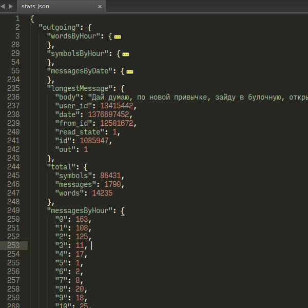
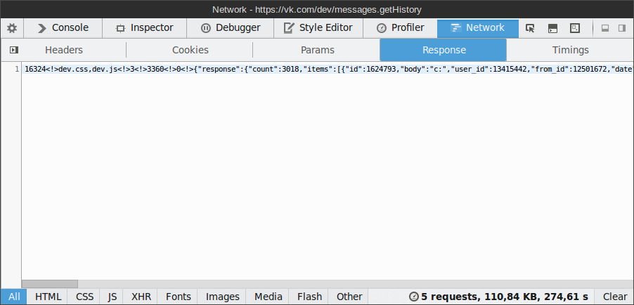

# /ul/

This, ugh, *thing* is actually ome sort of *data-miner* script. It scans your messages and doesn't afraid of anything.



Combine with Wolfram Alpha for pretty graphs and neat comparsions.

All the credit goes to Uliana-senpai ([@AliradeBlois](https://twitter.com/AliradeBlois)) and my curiosity.

Happy birthday.

## Usage

This script was intended for the VK social network, but can be easily adapted for any other network type.

`stats.py` uses a JSON array of messages. Each message should look be a :

```json
{
  "id": 1,
  "body": "Hey, are there any Death Note subs out there?",
  "date": 1338544456,
  "out": 1
}
```

The only required params are `body`, `date` and `out`, where `date` is UNIX time in seconds and `out` is `1` if the message is outgoing, otherwise `0`. (Yeah, it should probably be boolean instead, but [that's what they use](https://vk.com/dev/message)).

Output is a JSON object. Output consists of three categories: `incoming`, `outgoing` and `total`. The names are self-explainatory. Each category contains:

* `{symbols|words|messages}ByHour` histograms. Lets you see if you chat more actively in mornings, evenings or maybe at night.
* `total.{symbols|words|messages}` counts. Nuff said.
* `messagesByDate` This one was the primary reason I made this. This objects keys are UTC dates and values are the message counts on that particular day, like so: `"2012-06-01": 3`
* `longestMessage` Self-explainatory once again.

### Use it with VK

The easiest way to do so is to go to the [`messages.getHistory`](https://vk.com/dev/messages.getHistory) API page, open the devtools and send a test request. Set `count` to 200 and `offset` to 0. The response will look like this:



The JSON-looking part is what you're looking for. Place it into a file called `dump0.json` next to the `join.py` helper script. Now set `offset` to 200 and send another request. Place the result to the `dump1.json` file. Repeat until all the messages are dumped.

And yeah, this isn't *the best way* to do it, but well.

## Todo

- GUI. Nice graphs and stuff.
- Better way to dump messages from VK.
- Adapter for Facebook. Probably.
- ..?
